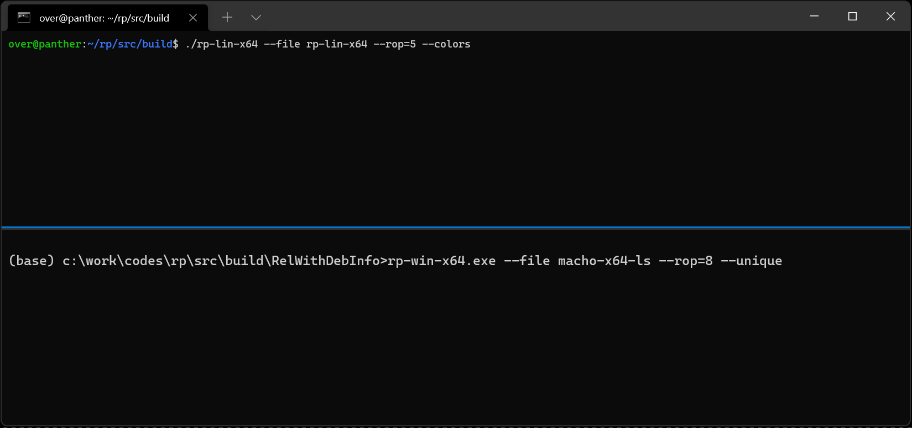

# rp++: a fast ROP gadget finder for PE/ELF/Mach-O x86/x64/ARM binaries


## Overview

**rp++** or **rp** is a C++ [ROP](https://en.wikipedia.org/wiki/Return-oriented_programming) gadget finder for [PE](https://docs.microsoft.com/en-us/windows/win32/debug/pe-format)/[ELF](https://en.wikipedia.org/wiki/Executable_and_Linkable_Format)/[Mach-O](https://en.wikipedia.org/wiki/Mach-O) executables and x86/x64/ARM architectures.

<p align='center'>

</p>

## Build

You can find shell scripts in [src/build](src/build) for every supported platforms; below is the Linux example:

```
src/build$ chmod u+x ./build-release.sh && ./build-release.sh
-- The C compiler identification is GNU 9.3.0
-- The CXX compiler identification is GNU 9.3.0
[...]
[16/16] Linking CXX executable rp-lin-x64
```

## Authors

* Axel '[0vercl0k](https://twitter.com/0vercl0k)' Souchet
