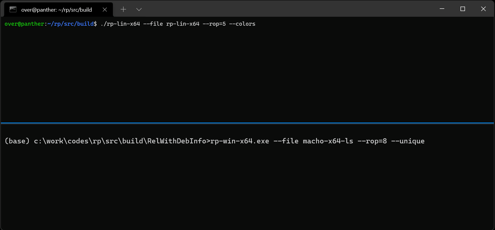

# rp++: a fast ROP gadget finder for PE/ELF/Mach-O x86/x64/ARM/ARM64 binaries


## Overview

**rp++** or **rp** is a C++ [ROP](https://en.wikipedia.org/wiki/Return-oriented_programming) gadget finder for [PE](https://docs.microsoft.com/en-us/windows/win32/debug/pe-format)/[ELF](https://en.wikipedia.org/wiki/Executable_and_Linkable_Format)/[Mach-O](https://en.wikipedia.org/wiki/Mach-O) executables and x86/x64/ARM/ARM64 architectures.

<p align='center'>

</p>

## Finding ROP gadgets

To find ROP gadget you need to specify a file with the `--file` / `-f` option and use the `--rop` / `-r` option specifying the maximum the number of instructions in the gadget:

<p align='center'>

</p>

You can customize the base address of the module with the `--va` option (if you pass a base of `0`, then you get relative offsets) and you can also use the `--raw` option to analyze raw code dumps.

## Finding pointers

Oftentimes when building ROP chains, you might need to find pointers to integers with specific values. To look for those, you can use the `--search-int` option like in the below:

<p align='center'>

</p>

Other times, you might need to find pointers to specific strings. To look for those, you can use the `--search-hexa` option like in the below:

<p align='center'>

</p>

You can also use the `--va` option to specify your own base address.

## Build

You can find shell scripts in [src/build](src/build) for every supported platforms; below is the Linux example:

```
src/build$ chmod u+x ./build-release.sh && ./build-release.sh
-- The C compiler identification is GNU 9.3.0
-- The CXX compiler identification is GNU 9.3.0
[...]
[16/16] Linking CXX executable rp-lin-x64
```

## Authors

* Axel '[0vercl0k](https://twitter.com/0vercl0k)' Souchet
