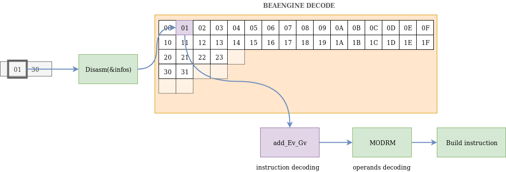
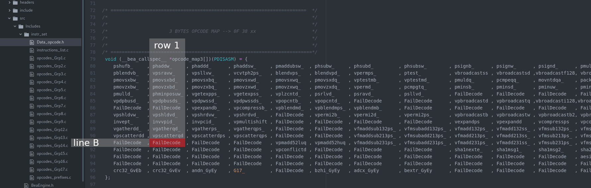

# developers corner

Adding a new instruction in BeaEngine is a 4 steps task :
 - step 1 : Implement unit test by adding a new file in `tests`
 - step 2 : Implement the function we will use to encode the new instruction in the file `src/Includes/instr_set/instructions_list.c`
 - step 3 : Add the proto in `src/Includes/protos.h`
 - step 4 : Add a pointer to the new function in the appropriate array from `src/Includes/instr_set/Data_opcode.h`

## 0. How is working BeaEngine

First of all, let's see how this library decodes bytes.



Let's assume we want to decode `01 30`. When you call `Disasm` function, here what happens :
- Disasm pick the first byte `01` and look for it in the first array opcodes `src/Includes/instr_set/Data_opcodes.h`
- This array gives in return a pointer to a function which is responsible of decoding. In our case, this is the `add_EvGv` function located in `src/Includes/instr_set/instructions_list.c`
- This new function is called and fill Disasm structures like Instruction.Mnemonic. To manage operands (encoded with the `30` byte), the function calls the internal ModR/M function.
- Finally, an internal Build Instruction is called to finish the process.

> Adding a new instruction in BeaEngine consists on adding the purples areas in the diagram :
> - Add a new function to decode the instruction
> - Add a pointer to this function in the opcodes array
## 1. Implementing unit test
BeaEngine is using **python-nose** to fire unit tests. Adding a new test for a general purpose instruction can be achieved like this :

```
from headers.BeaEnginePython import *
from nose.tools import *

class TestSuite:
    def test(self):

      # F3 0F 1E FA
      # ENDBR64

      Buffer = 'f30f1efa')
      myDisasm = Disasm(Buffer)
      myDisasm.read()
      assert_equal(myDisasm.infos.Instruction.Opcode, 0xf1e)
      assert_equal(myDisasm.infos.Instruction.Mnemonic, b'endbr64')
      assert_equal(myDisasm.repr(), 'endbr64')

```

Adding test with REX prefix can be done like this :

```
from headers.BeaEnginePython import *
from nose.tools import *

class TestSuite:
    def test(self):

    # 0F 03 /r
    # LSL reg, r32/m16

    myREX = REX()
    myREX.W = 1
    Buffer = '{:02x}0f0390'.format(myREX.byte()))
    myDisasm = Disasm(Buffer)
    myDisasm.read()
    assert_equal(myDisasm.infos.Instruction.Opcode, 0xf03)
    assert_equal(myDisasm.infos.Instruction.Mnemonic, b'lsl')
    assert_equal(myDisasm.repr(), 'lsl rdx, word ptr [rax+00000000h]')

```
For VEX & EVEX prefixes, we can proceed like that :

```
from headers.BeaEnginePython import *
from nose.tools import *


class TestSuite:

    def test(self):

        # VEX.256.66.0F3A.W1 00 /r ib
        # VPERMQ ymm1, ymm2/m256, imm8

        myVEX = VEX('VEX.256.66.0F3A.W1')
        Buffer = bytes.fromhex('{}00e011'.format(myVEX.c4()))
        myDisasm = Disasm(Buffer)
        myDisasm.read()
        assert_equal(myDisasm.infos.Instruction.Opcode, 0x00)
        assert_equal(myDisasm.infos.Instruction.Mnemonic, b'vpermq')
        assert_equal(myDisasm.repr(), 'vpermq ymm12, ymm8, 11h')

        # EVEX.256.66.0F3A.W1 00 /r ib
        # VPERMQ ymm1 {k1}{z}, ymm2/m256/m64bcst, imm8

        myEVEX = EVEX('EVEX.256.66.0F3A.W1')
        Buffer = bytes.fromhex('{}002011'.format(myEVEX.prefix()))
        myDisasm = Disasm(Buffer)
        myDisasm.read()
        assert_equal(myDisasm.infos.Instruction.Opcode, 0x00)
        assert_equal(myDisasm.infos.Instruction.Mnemonic, b'vpermq')
        assert_equal(myDisasm.repr(), 'vpermq ymm4, ymmword ptr [rax], 11h')
```

Commented strings come from intel documentation

## 2. Adding a new prefixed instruction

Here is some tips to add new instructions in BeaEngine. First of all, we must keep in mind there are 3 types of instructions :
- the prefixed instructions : these instructions are encoded with the schema `prefix opcode`
- the suffixed instructions : these instructions are encoded with the schema `opcode suffix`
- the prefixed/suffixed instructions : these rare instructions are encoded following the schema `prefix opcode suffix`

At the very beginning, Intel instructions were recognized by their opcodes (bytes used to encode instructions). For instance, instruction with the mnemonic **NOP** can be encoded by the opcode **0x90**. But, thanks to a complex mechanism of prefixes (called mandatory prefixes), one opcode can now be interpreted into 20 differents instructions. Let's call our opcode **xx** and have a look to these 20 differents representations :
 - no prefix
 - one of these 3 prefixes : 0xf2, 0xf3, 0x66
 - one of these 8 prefixes : VEX.W0, VEX.W1, VEX.66.W0, VEX.66.W1, VEX.F2.W0, VEX.F2.W1, VEX.F3.W0, VEX.F3.W1
 - one of these 8 prefixes : EVEX.W0, EVEX.W1, EVEX.66.W0, EVEX.66.W1, EVEX.F2.W0, EVEX.F2.W1, EVEX.F3.W0, EVEX.F3.W1

Actually, their is no instruction with all these representations for the same opcode but we can see how it could be implemented in BeaEngine thanks to the following template :

```
void __bea_callspec__ new_instr(PDISASM pMyDisasm)
{
  if (pMyDisasm->Prefix.LockPrefix == InvalidPrefix) GV.ERROR_OPCODE = UD_;
  verifyVEXvvvv(pMyDisasm);
  if (GV.EVEX.state == InUsePrefix) {
    switch(GV.VEX.pp){
      case 0:
        if (GV.EVEX.W == 0) {
          /* EVEX.W0 */
          failDecode(pMyDisasm);
        }
        else {
          /* EVEX.W1 */
          failDecode(pMyDisasm);
        }
        break;
      case 1:
        if (GV.EVEX.W == 0) {
          /* EVEX.66.W0 */
          failDecode(pMyDisasm);
        }
        else {
          /* EVEX.66.W1 */
          failDecode(pMyDisasm);
        }
        break;
      case 2:
        if (GV.EVEX.W == 0) {
          /* EVEX.F3.W0 */
          failDecode(pMyDisasm);
        }
        else {
          /* EVEX.F3.W1 */
          failDecode(pMyDisasm);
        }
        break;
      case 3:
        if (GV.EVEX.W == 0) {
          /* EVEX.F2.W0 */
          failDecode(pMyDisasm);
        }
        else {
          /* EVEX.F2.W1 */
          failDecode(pMyDisasm);
        }      
    }
  }
  else if (GV.VEX.state == InUsePrefix) {
    switch(GV.VEX.pp){
      case 0:
        if (GV.REX.W_ == 0) {
          /* VEX.W0 */
          failDecode(pMyDisasm);
        }
        else {
          /* VEX.W1 */
          failDecode(pMyDisasm);
        }
        break;
      case 1:
        if (GV.REX.W_ == 0) {
          /* VEX.66.W0 */
          failDecode(pMyDisasm);
        }
        else {
          /* VEX.66.W1 */
          failDecode(pMyDisasm);
        }
        break;
      case 2:
        if (GV.REX.W_ == 0) {
          /* VEX.F3.W0 */
          failDecode(pMyDisasm);
        }
        else {
          /* VEX.F3.W1 */
          failDecode(pMyDisasm);
        }
        break;
      case 3:
        if (GV.REX.W_ == 0) {
          /* VEX.F2.W0 */
          failDecode(pMyDisasm);
        }
        else {
          /* VEX.F2.W1 */
          failDecode(pMyDisasm);
        }      
    }
  }
  else {
    if (GV.PrefRepe == 1) {
      /* prefix 0xf3 */
      failDecode(pMyDisasm);
    }
    else if (GV.PrefRepne == 1) {
      /* prefix 0xf2 */
      failDecode(pMyDisasm);
    }
    else if (pMyDisasm->Prefix.OperandSize == InUsePrefix) {
      /* prefix 0x66 */
      failDecode(pMyDisasm);
    }
    else {
      /* no prefix */
      failDecode(pMyDisasm);
    }
  }
}
```

## 3. Adding a new suffixed instruction

Opcodes can be used with suffixes to encode differents instructions. This technic is very used to encode **Groups instructions**. Actually, here are the differents way used by intel :
- Using MOD & RegOpcode & RM from the ModR/M byte following schema `opcode modrm`
- Using low bits from an Immediat byte following schema `opcode modrm imm8`

Here is an example of an implementation of suffixed instruction thanks to ModR/M byte : (we can potentially encode 256 (8 x 8 x 4) different instructions with the same schema `opcode modrm`)

```
void __bea_callspec__ new_instr(PDISASM pMyDisasm)
{
  if (!Security(2, pMyDisasm)) return;
  GV.REGOPCODE = ((*((UInt8*) (GV.EIP_+1))) >> 3) & 0x7;
  GV.MOD_= ((*((UInt8*) (GV.EIP_+1))) >> 6) & 0x3;
  GV.RM_  = (*((UInt8*) (GV.EIP_+1))) & 0x7;
  switch(GV.REGOPCODE) {
    case 0:
      switch(GV.MOD_) {
        case 0:
          switch(GV.RM_) {
            case 0:
              failDecode(pMyDisasm);
              break;
            case 1:
              failDecode(pMyDisasm);
              break;
            case 2:
              failDecode(pMyDisasm);
              break;
            case 3:
              failDecode(pMyDisasm);
              break;
            case 4:
              failDecode(pMyDisasm);
              break;
            case 5:
              failDecode(pMyDisasm);
              break;
            case 6:
              failDecode(pMyDisasm);
              break;
            case 7:
              failDecode(pMyDisasm);
          }
        case 1:
          failDecode(pMyDisasm);
          break;
        case 2:
          failDecode(pMyDisasm);
          break;
        case 3:
          failDecode(pMyDisasm);
      }
      break;
    case 1:
      failDecode(pMyDisasm);
      break;
    case 2:
      failDecode(pMyDisasm);
      break;
    case 3:
      failDecode(pMyDisasm);
      break;
    case 4:
      failDecode(pMyDisasm);
      break;
    case 5:
      failDecode(pMyDisasm);
      break;
    case 6:
      failDecode(pMyDisasm);
      break;
    case 7:
      failDecode(pMyDisasm);
  }
}
```

## 4. managing operands & mnemonic
Previous templates only implement a `failDecode` function. If you want to add a mnemonic and operands, replace the `failDecode(pMyDisasm)` by something like this :

**simplest implementation**
```
(*pMyDisasm).Instruction.Category = GENERAL_PURPOSE_INSTRUCTION+ARITHMETIC_INSTRUCTION;
#ifndef BEA_LIGHT_DISASSEMBLY
   (void) strcpy ((*pMyDisasm).Instruction.Mnemonic, "aaa");
#endif
GV.EIP_++;
```
Here the instruction is one byte long, we just need to fill *Instruction.Category* & *Instruction.Mnemonic*. Don't forget to increment GV.EIP_ !

**more complex example**

```
(*pMyDisasm).Instruction.Category = GENERAL_PURPOSE_INSTRUCTION+ARITHMETIC_INSTRUCTION;
#ifndef BEA_LIGHT_DISASSEMBLY
   (void) strcpy ((*pMyDisasm).Instruction.Mnemonic, "add");
#endif
switch(GV.OperandSize) {
  case 16:
    GV.MemDecoration = Arg1word;
    break;
  case 32:
    GV.MemDecoration = Arg1dword;
    break;
  case 64:
    GV.MemDecoration = Arg1qword;
}
decodeModrm(&(*pMyDisasm).Operand1, pMyDisasm);
decodeRegOpcode(&(*pMyDisasm).Operand2, pMyDisasm);
GV.EIP_ += GV.DECALAGE_EIP+2;
```
*MemDecoration* is a manual parameter used to decorate output when operand is a memory operand. *MOD_RM* and *Reg_Opcode* are used to fill **Operand1** and **Operand2**. Fortunatly, there are a lot of helpers to avoid operand decoding complexity.


## 5. Adding proto
Just add the proto in `src/Includes/protos.h` :

```
void __bea_callspec__ new_instr(PDISASM);
```

## 6. Add pointer in Data_opcode arrays

Choose your function location in the appropriate array. In the example below, in the array `0F 38`, we can see a failDecode function at line B, row 1. Replacing this function by `new_instr` means that BeaEngine will give control to `new_instr` each time it tries to decode `0F 38 B1`


